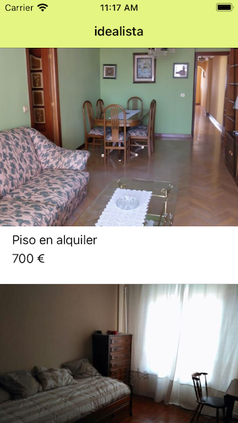

#  idealista iOS Challenge
idealista iOS crew needs you! We need a fellow to face our everyday challenges: new features, problem fixes, UI design, performance, security, backwards compatibility, testing...
This repository contains a project ready to work with, but we need your help to build the next amazing features that will bring it to the next level, are you ready to go?

We love clean code and beautiful layouts, structured implementation and testable components. Does it sound good to you? This is your challenge!

## Getting started
This repository contains a working iOS app that retrieves a list of ads

  

The app used UIKit and xibs for render the views and have no dependencies with any library

## Tasks

Your task is to **clone** this repository and take into consideration next steps

###### New features to add

1. Create a detail view and navigate to it from ads list.
    The detail URL is in the response of the ad list
2. Add a new feature to favourite ads

###### Some optional tasks to do (bonus):

1. Add pull to refresh to the listing
2. Localize the app in english
3. Add some test
4. Refactor the initial code
5. Visual improvements

###### Once you've finished

1. Notify by email to rrhh@idealista.com which branch of your repo you want our iOS team analyze or send us the project folder (including the .git)
2. Have a beer after the work done